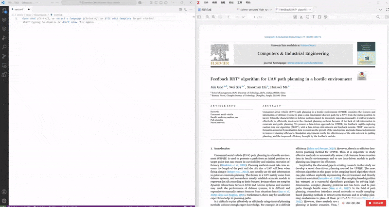

# zotero-link

Zotero is a very popular academic management tool. Although it provides its own note-taking tool, many people still choose to take notes in Markdown using VSCode. One of the great features of Zotero's note-taking tool is that you can click on the extracted notes to return to the original text, and it also supports adding corresponding jump links to the copied content. These links look like this:

```markdown
“Specifically, if the distance between the current MAV position pc and the goal position G exceeds the planning horizon H, we project G onto a sphere centered at pc with a radius of H to obtain pg; otherwise, pg is set to G.” ([Ren 等, 2025, p. 14](zotero://select/library/items/YESAKMB6)) ([pdf](zotero://open-pdf/library/items/7DNHE65J?page=14&annotation=VU2CTMUA))
```

These links work properly in a browser, but not in VSCode. This plugin was created to solve this problem, allowing you to use Ctrl+left mouse click on Zotero links in Markdown notes to jump to the corresponding original text in Zotero.

## Features

1. Drag the original text into the note.
2. Use **Ctrl + left mouse click** to jump to the original text.



## Requirements

……

## Extension Settings

……

## Known Issues

……

## Release Notes

Users see my release notes when I release a new version.

### 0.0.1

Initial release

### 0.0.2

The extension behavior is changed to open the link on the ui side.

## Acknowledgements

Thanks to @jorisvanzundert /[zotero-link-opener](https://github.com/jorisvanzundert/zotero-link-opener) for inspiration 
